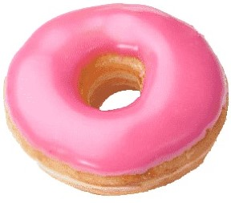

# Exp-2 Create a commercial website using HTML & CSS.
## Aim:
To create a commercial website using HTML & CSS.
## Algorithm:
### Step 1:
Create basic outline for website using html. 
### Step 2:
Create style part of the website using css.
### Step 3:
Link the css file with html code using link tag
### Step 4:
Run the code and check the webpage in an web browser.
## Program:
### Html:
```html
<!DOCTYPE html>
<html lang="en">
  <head>
    <title>baker</title>
    <link rel="stylesheet" href="style.css" />
    <link rel="icon" href="./img/icon.png" type="image/x-icon" />
  </head>

  <body>
    <div class="container">
      <div class="menu">
        
        <div class="menuitem"><a href="#pages">Pages</a></div>
        <div class="menuitem"><a href="#portfolio">Portfolio</a></div>
        <h2 class="menuitem">Baker</h2>
        <div class="menuitem"><a href="#blog">Blog</a></div>
        <div class="menuitem"><a href="#shop">Shop</a></div>
        <div class="menuitem"><a href="#elements">Elements</a></div>
      </br>
        <h3 class="color">Q U I &nbsp&nbspG O Û T E</h3>
        <h1 class="color">T R È S&nbsp&nbsp&nbsp&nbsp B O N</h1>
        <h1>Bakery</h1>
      </div> 
      <div class="containerbody">
        <div class="items">
        <div class="imagecinnamon">
          
        </div>
        <div class="text" align="center">
        </br>
            <h1>CINNAMON ROLLS</h1>
            <p style="font-size: 15px; font-weight: 20%;color: #6f6b6b;">Lorem ipsum dolor sit amet, consectetur adipiscing elit. Phasellus imperdiet, nulla et dictum interdum, nisi lorem egestas vitae scel<span id="dots">...</span></p>
            <button>read more</button> 
        </div>
    </div>
    <div class="items">
        <div class="text" align="center">
            <h1>STRAWBERY DONUT</h1>
            <p style="font-size: 15px;font-weight: 20%; color:#6f6b6b;">Lorem ipsum dolor sit amet, consectetur adipiscing elit. Phasellus imperdiet, nulla et dictum interdum, nisi lorem egestas vitae scel<span id="dots">...</span></p>
            <button>read more</button>
        </div>
        <div class="imagedonut">
          
        </div>
    </div>
    <div class="items">
        <div class="imagepoppy">
          
        </div>
        <div class="text" align="center">
        
            <h1>POPPY CROISSANT</h1>
            <p style="font-size: 15px;font-weight: 20%; color:#6f6b6b;">Lorem ipsum dolor sit amet, consectetur adipiscing elit. Phasellus imperdiet, nulla et dictum interdum, nisi lorem egestas vitae scel<span id="dots">...</span></p>
            <button>read more</button>
        </div>
      </div>

      <div class="items">
        <div class="text" align="center">
            <h1>BLUEBERRY MUFFIN</h1>
            <p style="font-size: 15px;font-weight: 20%; color:#6f6b6b;">Lorem ipsum dolor sit amet, consectetur adipiscing elit. Phasellus imperdiet, nulla et dictum interdum, nisi lorem egestas vitae scel<span id="dots">...</span></p>
            <button>read more</button>
        </div>
        <div class="imagemuffin">
          
        </div>
      </div>
      </div>
      <div class="footer" align="center">
        <p class="menuitem">Lorem ipsum dolor sit amet, consectetur adipiscing elit.&nbsp&nbsp&nbsp&nbsp&nbsp&nbsp&nbsp&nbsp&nbsp&nbsp&nbsp&nbsp</p>
        <button class="purchase">Purchase&nbsp&nbspNow</button>
      </div>
    </body>
</html>
```
### CSS:
```css
.container {
    width: 1080px;
    height: 265px;
    margin-left: auto;
    margin-right: auto;
    

  }
  .containerbody {
    width: 1080px;
    height: 1460px;
    margin-left: auto;
    margin-right: auto;
  }
  
  .menu {
    display: block;
    width: 100%;
    height: 320px;
    font-size: larger;
    background-color: pink;
    text-align: center;
    padding-top: 15px;
    margin: 0px 0px 0px 0px;
    border-width: 1px;
  }
  
  .menuitem {
    display: inline-block;
    margin-left: 10px;
    margin-right: 10px;
  }
  .menuitem a
  {
    color: black;
    border-left: 2px;
  }
  .menuitemselected a
  {
    color: black;
    border-left: 2px;
  }
  .color
  {
    color:aliceblue
  }
  .items 
  {
    display: block;
    width: 100%;
    height: 350px;
    font-size: larger;
    background-color: white;
    padding-top: 15px;
    margin: 0px 0px 0px 0px;
    border-width: 1px;
  }
  .itemstext
  {
    display: inline-block;
    margin-left: 10px;
    margin-right: 10px;
  }
  .imagecinnamon
  {
    display: block;
    width: 50%;
    height: 350px;
    font-size: medium;
    background-color: white;
    margin: 0px 0px 0px 0px;
    float: left;
    border-color: aliceblue;
  }
  .imagedonut
  {
    display: block;
    width: 50%;
    height: 350px;
    font-size: medium;
    background-color: white;
    margin: 0px 0px 0px 0px;
    float: left;
    border-color: aliceblue;
  }
  .imagepoppy
  {
    display: block;
    width: 50%;
    height: 350px;
    font-size: medium;
    background-color: white;
    margin: 0px 0px 0px 0px;
    float: left;
    border-color: aliceblue;
  }
  .imagemuffin
  {
    display: block;
    width: 50%;
    height: 350px;
    font-size: medium;
    background-color: white;
    margin: 0px 0px 0px 0px;
    float: left;
    border-color: aliceblue;
  }
  .text
  {
    float: left;
    width: 50%;
    height: 350px;
    margin-left: auto;
    margin-right: auto;
  }
  .footer
  {
    height: 70px;
    padding-top: 20px;
    background-color: pink;
    text-align: center;
  }
  .footer p
  {
    color: white;
  }
  .center
  {
    margin-left: auto;
    margin-right: auto;
    margin-top: 70px;
    display: block;
  }
  button
  {
    border-radius: 10px;
    color: black;
    text-shadow: none;
    border: 1px solid white;
    width: 100px;
    height: 40px;
    background-color: pink;
  }
  .purchase
  {
    color: white;
    text-shadow: none;
    border: 1px solid pink;
    width: 150px;
    height: 40px;
    background-color: black;
    border-radius: 0%;
    
  }
  .baker
  {
    mix-blend-mode: darken;
  }
  .p
  {
    font-weight: lighter;
  }
  .img 
  {
    display: flex;
    justify-content: center;
  }
```
## Output:

## Result:
A commercial website using HTML & CSS has been created and output verified sucessfully.
